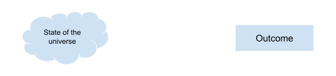
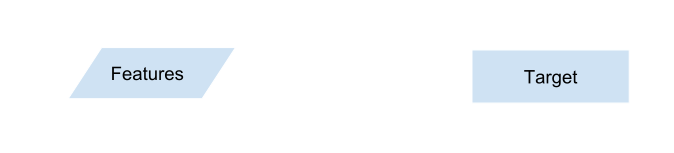
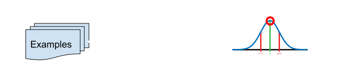
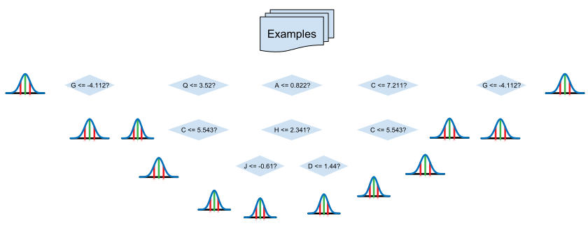

class: middle, title

# Type-Oriented Programming
## Building and using libraries for<br />self-assembling programs

---

# About the speaker

Jeremy Smith<br />
Sr. Software Engineer @ Netflix (We're hiring!)

.social[ [in/gentleman-and-a-scala](https://www.linkedin.com/in/gentleman-and-a-scala)]
.social[ [jeremyrsmith](https://github.com/jeremyrsmith)]
.social[ [@jeremyrsmith](https://twitter.com/jeremyrsmith)]

---

# Agenda

1. Review implicits and typeclasses
2. Look at dependent types
3. Some shapeless concepts
4. Basic machine learning
5. Let's build it!

---

# Predef

What you'll need for the programming part:

* An IDE (I'm using IntelliJ)
   * (Or an editor + sbt)
* Git
* The code: github.com/jeremyrsmith/scalax-workshop

---

# `implicitly[WTF?]`

A few points about implicits:

* Not all implicits are evil.
* The word `implicit` means too many things.

--

Let's differentiate between .red[**implicits**] and .red[**non-explicits**].

---

class: big-code

# Non-explicits

Implicit conversions:

```scala
implicit def thisIsBad(str: String): Int = str.toInt
```

--

Don't do this.

--

(unless you have a really good reason)

---

class: big-code

# Non-explicits

Extension methods:

```scala
implicit class FunctorOps[F[_] : Functor, A](self: F[A]) {
  def map[B](fn: A => B): F[B] = Functor[F].map(fn)(self)
}
```

--

This is fine, but not the same flavor of `implicit` that we're going to talk about.

---

# Implicits

We'll be talking about implicits as in .red[**implication**]. They're a logic programming construct!

--

* Implicits are a logic program! (think prolog)

--

* It executes at compile time...

--

* And the result is the program that you compiled!

---

# Implicit logic

Implicits are much easier to reason about if you stick to using them as a logic program:

* Only use implicits that are parametric over one or more types (typeclasses)
* Avoid implicit conversions
* Try to keep your implicits in .red[**implicit scope**] (we'll talk about this)

---

class: big-code

# Implicit logic

An implicit value is like a .red[**fact**]:

```scala
implicit val listFunctor: Functor[List] = ???
```

--

This says, "List is a Functor, and here's the proof".

--

(.red[**Proof**] will be a handy way to look at implicits when using shapeless)

---

class: big-code

# Implicit logic

An implicit parameter is like a .red[**supposition**]:

```scala
def sum[A](list: List[A])(implicit monoid: Monoid[A]): A =
  ???
```

--

This says, "Suppose `A` forms a monoid. Then the sum of a list of `A` can be computed as follows."

--

At compile time, invoking `sum` will require .red[**proof**] that `A` forms a monoid, in the form of
an implicit `Monoid[A]`.

---

# Implicit logic

An implicit .red[**derivation**] is like .red[**logical implication**]:

```scala
implicit def tupleMonoid[A, B](implicit
  monoidA: Monoid[A],
  monoidB: Monoid[B]
): Monoid[(A, B)] = ???
```

--

This says, "Suppose `A` and `B` each form a monoid. Then it follows that the tuples `(A, B)` also form a monoid, defined
like this."

--

.red[**Note**]: This is different from an implicit conversion!

---

# Typeclasses

Types which have type parameters and are intended to serve as implicit proof – like `Monoid` and `Functor` above –
are called .red[**typeclasses**] (or type classes).

--

They're very useful for abstracting functions over types using .red[**parametric polymorphism**].

--

This is a whole other talk – you can google it or talk to me afterwards if you need help understanding.

---

# Typeclasses and dependent types

Scala allows a form of .red[**dependent types**]. Values can (sort of) carry types:

```scala
trait Foo[A] {
  type Bar
}
```

--

This feature really shines with typeclasses, because they can also be .red[**type functions**].

---

# Type functions

Here's a toy example:

```scala
trait Add[A, B] {
  type Result
  def apply(a: A, b: B): Result
}
```

--

We want to express that two types, `A` and `B` can be added together, and the result type is `Result`.

--

For example, adding `Int` to `Int` results in `Int`, but adding `Int` and `Double` results in `Double`. (Pretend the
compiler doesn't already do that!)

---

```scala
object Add {
  def apply[A, B](a: A, b: B)(
    implicit add: Add[A, B]
  ): add.Result = add(a, b)

  implicit val addIntDouble: Add[Int, Double] =
    new Add[Int, Double] {
      type Result = Double
      def apply(a: Int, b: Double): Double = a + b
    }
}
```

--

Now invoking `Add(1, 2.0)` results in finding the implicit instance we defined, and the result type is statically known
to be its `Result` type, which is `Double`.

---

# An introduction to shapeless

Shapeless is mostly **a collection of typeclasses** which are also type functions as described above.

--

The magic trick it uses involves recursive (inductive) application of these type functions.

--

It also has a couple of novel data types to support this, and a few key typeclasses for moving between case classes and
recursive types.

---

# Recursive types

Let's think about the `List[A]` data type in Scala. It's essentially a nested 2-tuple `(A, List[A])`:

```scala
(A,
  (A,
    (A, Nil)))
```

--

The head is an `A`, and the tail is a `List[A]`.

---

# Recursive types

What if the head and tail could have their own types?

--

```scala
(A,
  (B,
    (C, D)))
```

--

This is `HList` - the heterogeneous list type.

--

It allows a list in which the type of each element is statically known.

---

`HList` looks something like this:

```scala
sealed trait HList

final case class ::[H, T <: HList](
  head: H,
  tail: T
) extends HList

sealed trait HNil extends HList
case object HNil extends HNil
```

---

# HList

Now you can define a statically typed list:

```scala
val hlist = 10 :: "hello" :: true :: HNil
```

--

Its type is `Int :: String :: Boolean :: HNil`.

--

Without the infix type, it looks like

`::[Int, ::[String, ::[Boolean, HNil]]]`

See how it splits into a head and a tail, which again splits into head and tail and so forth?

---

# But why?

This might not seem all that useful at first glance...

--

But combine it with typeclasses!

--

Remember that `Monoid` derivation for tuples? It would have been awfully tedious to define that for 3-tuples, and 4-tuples,
and so forth. There would be 21 derivations! 

---

# Inductive derivation

With `HList`, we can derive `Monoid` for all possible `HList`s with only one fact and one derivation!

```scala
implicit val monoidHNil: Monoid[HNil] = ???

implicit def monoidHList[H, T <: HList](implicit
  monoidH: Monoid[H],
  monoidT: Monoid[T]
): Monoid[H :: T] = ???
```

--

This is the main magic trick behind shapeless. It finds the `Monoid` for `H`, and then looks for the `Monoid` for `T`,
which leads it back to the derivation, recursively until `HNil` is reached.

---

# Inductive derivation

Let's pause and discuss.

---

# But I don't want to use `HList`s everywhere!

Of course you'd rather use

`case class Foo(a: Int, b: String)`
 
instead of `Int :: String :: HNil`.

--

So shapeless has a special typeclass, `Generic`.

--

It lets you convert case classes to the corresponding `HList` representation, and back.

--

So you can go to `HList` land, do the inductive stuff, and go back if necessary.

---

# Example

We can already derive `Monoid` for every `HList` type, as long as all the elements are themselves `Monoid`. Let's do
the same thing for case classes, with *one more derivation!*

--

```scala
implicit def monoidGeneric[A, L <: HList](implicit
  gen: Generic.Aux[A, L],
  monoidL: Monoid[L]
): Monoid[A] = new Monoid[A] {
  def identity: A = gen.from(monoidL.identity)
  def combine(a: A, b: A): A =
    gen.from(monoidL.combine(gen.to(a), gen.to(b)))
}
```

---

# What's `Aux`?

Type functions work because the dependent type can be .red[**inferred**] from the input type(s) by resolving the implicit.

--

But what if we need to infer another implicit (or apply another type function on) the result type?

---

What we want to do is this:

```scala
implicit def monoidGeneric[A](implicit
  gen: Generic[A],
  monoidL: Monoid[gen.Repr]
)
```

(here `Repr` is what `Generic`'s dependent result type is called)

--

But that's not legal Scala – you can't refer to another argument in the same parameter list!

---

# Enter `Aux`

Instead, you can "assign" the result type to a free type parameter by using a .red[**structural refinement**]:

```scala
implicit def monoidGeneric[A, L <: HList](implicit
  gen: Generic[A] { type Repr = L },
  monoidL: Monoid[L]
)
```

--

Then, when the compiler infers `Generic[A]`, it will infer `L` to be that instance's `Repr` type.

---

# Enter `Aux`

Now we can use `L` instead of `gen.Repr`, working around the limitation.

--

It's another magic trick without which shapeless probably couldn't exist in a useful way. (Should be fixed in Dotty!)

--

And we might as well make a type alias to avoid the user having to write that structural type:

```scala
object Generic {
  type Aux[A, Repr0] = Generic[A] { type Repr = Repr0 }
}
```

---

# Bring your types

Defining generic typeclass derivations like this lets you build libraries that .red[**self-assemble**] into programs
when the user brings their case classes.

--

There are type-oriented libraries for things like:

* Reading/writing JSON/YAML/CSV/Avro/etc
* Parsing and pretty-printing
* Database mapping
* Functional programming
* Many more! (see appendix for some examples)

---

# Bring your types

But when you think about it, a lot of .red[**business logic**] can be thought of as boilerplate over types.

--

Let's look at a machine learning algorithm and see if TOP can work there.

---

# ML crash course!

Supervised ML starts with a problem:



We want to model the process, so that we can predict the outcome from the state.

---

For example, let's say the process is a customer's decision making, and the outcome is whether or not they bought a
particular product.

--

We want to come up with a function that will take some state and output whether the customer will buy the product.

--

We can't keep track of (or process) the entire state of the universe!

---

# Features

So, we choose a subset of that which we think might be important.

--

E.g. information about the customer, the product, and their relationship.

--

Choosing these .red[**features**] is a hugely important process which we're going to gloss over!

---

# Fit a function

So we want a function that takes the features we chose, and returns the decision they'll make.



---

# Fit a function

To get one, we'll collect real-world examples of:

* The features recorded *before* the customer decided
* Whether the customer ended up buying the product (the *target* or *label*)

--

Then we'll run them through some algorithm which will try to find an approximation that works the best with those
examples.

--
 
This is called *training* a model.

---

# The simplest model

Here's an easy way to go: just take all those targets as a distribution – like a normal distribution – and always return
the most probable value.
 
I.e. the result function just returns a constant – the mean of the targets in the training data.



---

# The simplest model

It's simple, but won't perform very well!

--

Maybe there's a way to do a little better?

---

# The simplest model

OK, what about this: maybe we can look at one of the features, and based on its value we can split the training data into
*two* distributions, where each one is more specific than the overall one?


---

And hey! Maybe then we could split up each of *those* distributions again! And again and again?



--

Then, in the end you'd have a sort of...

---

# Decision tree

There's a very straightforward way to train this type of model (by no means the most efficient):

* For each feature:
  * Sort the entire dataset by that feature
  * Iterate the sorted dataset to find the split point that minimizes variance in the target on both sides
* Split the dataset on the feature which had the best reduction in variance
* Repeat recursively until some specified condition is reached (e.g. maximum depth, or if we can't reduce the variance anymore)

---

# A typical DT library

Usually, the user of a decision tree library will have to:

1. Convert all of their features and targets to a big matrix of `Double`s
2. Specify a bunch of semantic metadata about the types of features (for subtleties in how they're treated)
3. Train the model
4. To predict with the model, again convert all the features to `Double`

--

This is a lot of boilerplate. Can we use types instead?

---

# Approach #1

We could write some typeclasses for converting case classes into arrays of `Double`...

--

And at the same time we could derive the necessary metadata based on actual types.

--

Let's breeze through the implementation of that quickly, and then we'll look at another approach.

--

(Programming interlude!)

---

# Approach #2

Think about the algorithm a little bit. What's the biggest source of inefficiency?

--

All of that sorting! Every partition of 𝑵 values has to be sorted 𝑴 times – once per feature!

--

At best we're talking \\(O(MN\log{N})\\)

--

But hang on... is that true for all types of features?

---

# Self-assembling and self-optimizing!

Notice that a lot of our features are boolean. We're treating those as `Double` by converting them to `0.0` or `1.0`.

--

But no matter what value between 1 and 0 we use to split those, there is only one way to split them! So why sort at all?

--

If we could find splits in a different way for Boolean features, we'd save a lot of sorting!

--

How about a split-finding typeclass – and a tree learner typeclass which will be derived from a set of them?

---

Let's implement this with shapeless.

(Another programming interlude!)

---

# Problem

We've got an elephant in the room that we haven't talked about... .red[**performance**].

--

Each of the `Selector`s we used will essentially grab a value from an `HList` by its index. But there are some
performance problems with that:

* Indexing into an `HList` is \\(O(N)\\)!
* Every data point is now an `HList`, and each cons cell is an object allocation!
* `HList` cons cells are not specialized, so the values are all boxed! *Another* object allocation!

---

# Performance

The biggest pitfall with shapeless is that it can kill efficiency in performance-critical code. How can we work around
this?

--

Let's talk about some strategies.

--
 
(I already picked one to move forward with.)

---

# Performance

Since we have to sort the partitions coherently, a row-oriented scheme will have advantages over columnar.

--

But we would need a specialized data structure which can store all of the feature values together unboxed...

--

We already have one: *the case class*!

--

Let's not convert everything to `HList`s or even `Doubles`, and instead keep it in its original form. 

---

We just need a way of getting at each element of a row. Like a function `Features => A` for every field of `Features`.

--

A typeclass to give us an `HList` of these functions (in the same shape as `Features`) would be ideal...
 
--

But shapeless doesn't provide that. 😞

---

# Macros to the rescue

If you're brave enough, it's not too hard to implement with a macro.

I've included it in the source!

Study it at your leisure, because we don't have time to talk macros (that's another show!)

---

Now there's only one `HList`, rather than \\(N\\).

We'll give the "getter" function for each field to the corresponding split finder during the final derivation, and performance problems are solved!

--

(Let's implement that now... if we still have time ⏱⏱⏱)

---

class: center, middle

.logo[.alt[Netflix Logo]]

## Questions?
